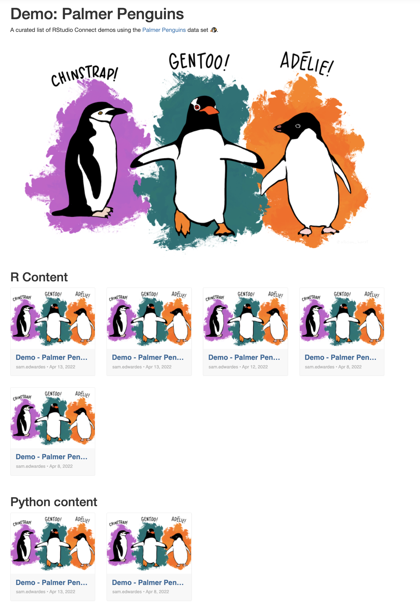

# demo-connect-widgets-penguins

A demo of connect widgets in RStudio Connect.



## Usage

To render the report locally:

```r
rmarkdown::render("app/report.Rmd")
```

## Deployment

### Git-backed

To deploy to RStudio connect refresh the manifest.json file:

```r
rsconnect::writeManifest("app", appFiles = c("report.Rmd", "imgs"))
```

Then, push any changes to git. RStudio connect will automatically deploy any changes.

### Programmatic

You can also deploy using the rsconnect api:

```
rsconnect::deployDoc(
  doc = "app/report.Rmd",
  appTitle = "Connect Widget Example"
)
```